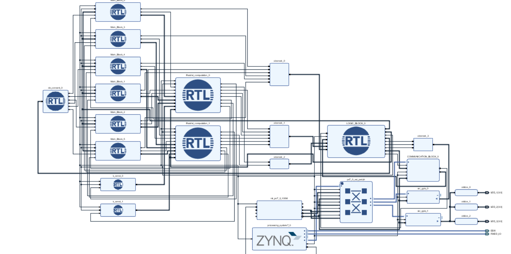
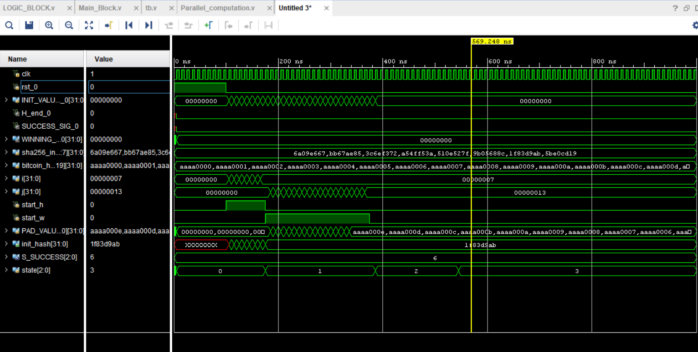
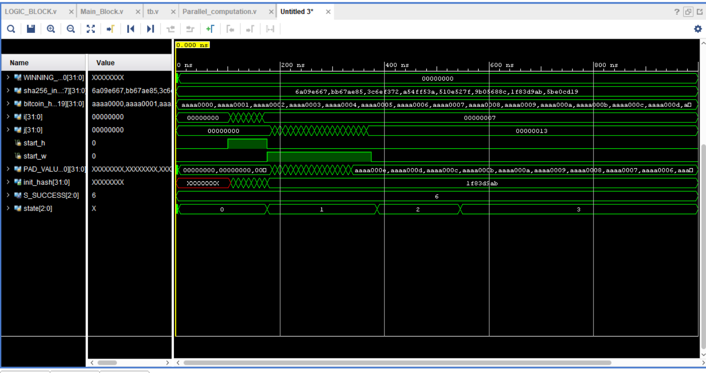
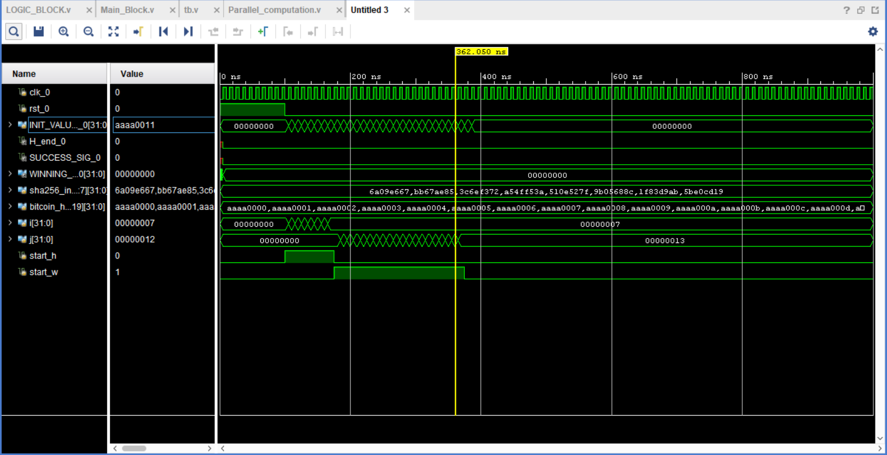

# BITCOIN 

---

# 🚀 Bitcoin Hashing using Verilog (Pipelined SHA-256)

## 📌 Overview

This project implements **Bitcoin-style double SHA-256 hashing** using **Verilog HDL** with a **pipelined architecture** for high-throughput performance. The design is inspired by the research paper:

> *“High-Performance SHA-256 Architecture for Bitcoin Mining”* (ICACT 2019)

The system processes block headers and computes hashes in a **parallel + pipelined manner**, making it suitable for FPGA-based acceleration.

---

## 🧠 Key Concepts

### 🔐 Bitcoin Hashing

Bitcoin uses **double SHA-256 hashing**:

```
Hash = SHA256(SHA256(Block_Header))
```

Where:

* Input = 512-bit block header
* Output = 256-bit hash

---

### ⚙️ SHA-256 Basics

SHA-256 operates on:

* 512-bit input blocks
* 64 rounds of transformation
* Uses:

  * Message schedule array `W[0..63]`
  * Working variables `a, b, c, d, e, f, g, h`

---

## 🏗️ Architecture

### ✅ Pipelined Design

* Each SHA-256 round is mapped to a **pipeline stage**
* Enables **parallel processing of multiple inputs**
* Improves throughput significantly

### ✅ Parallel Computation

* Multiple nonce values processed simultaneously
* Helps in **faster mining-style computation**

---

## 🧩 Module Breakdown

### 1. `Main_Block.v`

* Implements core SHA-256 round logic
* Handles:

  * Compression function
  * Message schedule updates

---

### 2. `Parallel_computation.v`

* Instantiates multiple SHA-256 cores
* Performs hashing for different inputs in parallel

---

### 3. `LOGIC_BLOCK.v`

* Controls:

  * Input distribution
  * Output selection
  * Hash comparison (for mining condition)

---

### 4. `Communication_Block`

* Interfaces with external modules (e.g., Zynq)
* Transfers data between processor and hashing logic

---

### 5. `tb.v` (Testbench)

* Provides stimulus:

  * Block header inputs
  * Clock & reset
* Verifies:

  * Hash correctness
  * Pipeline behavior

---

## 🔄 Pipeline Flow

1. Input block header loaded
2. Message expanded into `W[0..63]`
3. Each pipeline stage computes:

   * One SHA-256 round
4. Intermediate values passed forward
5. Final hash generated after 64 stages
6. Second SHA-256 applied (double hashing)

---

## 📊 Features

* ✅ Fully pipelined SHA-256
* ✅ Parallel hashing units
* ✅ High throughput design
* ✅ FPGA-friendly architecture
* ✅ Modular Verilog implementation

---

## 📷 Simulation Insights

### Observations from Waveforms:

* Proper clock-driven pipeline progression
* State transitions (0 → 1 → 2 → 3) indicate pipeline stages
* Stable hash output after pipeline latency
* Parallel inputs processed simultaneously




---

## 🧪 Verification

* Functional simulation performed
* Testbench validates:

  * Correct hash generation
  * Timing consistency
* No race conditions observed

---

## ⚡ Performance Advantages

| Feature         | Benefit                 |
| --------------- | ----------------------- |
| Pipelining      | High throughput         |
| Parallel Units  | Faster hash computation |
| Hardware Design | Low latency vs software |

---

## 🛠️ Tools Used

* Verilog HDL
* Vivado (for simulation & synthesis)
* GTKWave / Vivado Waveform Viewer

---

## 📚 Reference

* ICACT 2019 Paper:
  [https://icact.org/upload/2019/0502/20190502_finalpaper.pdf](https://icact.org/upload/2019/0502/20190502_finalpaper.pdf)

---

## 🚧 Future Improvements

* Add **difficulty target comparison**
* Optimize pipeline depth
* Implement **ASIC-level optimizations**
* Add **nonce generator module**

---

## 👨‍💻 Author

**Suryansh Bhardwaj**
B.Tech (Electronics & ML)

---

